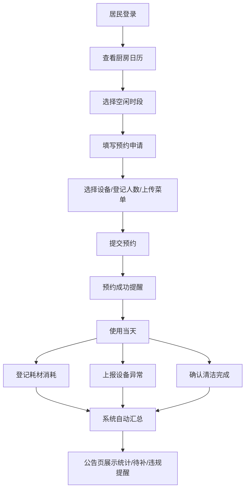

## 1. 产品概述

社区共享厨房管理系统，旨在帮助社区高效管理共享厨房的日常预约、物资使用和值班安排，解决居民使用冲突、物资管理混乱和清洁责任不清等问题。
- 目标用户：社区管理员和社区居民
- 产品价值：提升共享厨房使用效率，降低管理成本，营造整洁有序的共享环境

## 2. 核心功能

### 2.1 用户角色

| 角色 | 说明 | 核心权限 |
|------|------|----------|
| 管理员 | 社区厨房运营管理人员 | 设置预约规则、管理物资、查看统计、发布公告、处理违规 |
| 居民 | 社区内使用共享厨房的用户 | 查看日历、提交预约、登记使用情况、查看公告 |

### 2.2 功能模块

1. **厨房日历页**：日历视图展示预约情况、时段选择、预约冲突提示
2. **预约申请页**：填写用途说明、选择灶台设备、登记同行人数、上传活动菜单
3. **物资清单页**：物资列表、库存状态、耗材消耗登记、待补物资提醒
4. **值班记录页**：值班安排、清洁检查、设备异常上报、使用记录
5. **公告页**：公告发布、通知展示、违规提醒、系统统计

### 2.3 页面详情

| 页面名称 | 模块名称 | 功能描述 |
|-----------|-------------|---------------------|
| 厨房日历页 | 日历网格 | 月视图展示每日预约情况，点击日期查看时段详情 |
| 厨房日历页 | 时段列表 | 显示所选日期各时段的预约状态（空闲/已预约/已满） |
| 厨房日历页 | 预约冲突提示 | 高亮显示存在冲突的时段，提示重叠预约 |
| 厨房日历页 | 快速筛选 | 按设备类型、时段类型筛选可用档期 |
| 预约申请页 | 基本信息表单 | 填写活动名称、用途说明、预约日期和时段 |
| 预约申请页 | 设备选择 | 多选灶台/烤箱/蒸箱等设备，显示设备可用状态 |
| 预约申请页 | 人数登记 | 填写同行人数，校验人数上限 |
| 预约申请页 | 菜单上传 | 上传活动菜单图片或填写文字菜单 |
| 预约申请页 | 预约确认 | 预览预约信息，提交申请 |
| 物资清单页 | 物资分类列表 | 按厨具/食材/耗材分类展示物资 |
| 物资清单页 | 库存状态 | 显示当前库存、安全库存、低库存警告 |
| 物资清单页 | 消耗登记 | 使用后登记耗材消耗数量 |
| 物资清单页 | 待补物资 | 汇总低于安全库存的物资清单 |
| 值班记录页 | 值班人员列表 | 显示当日/本周值班安排 |
| 值班记录页 | 清洁检查表 | 逐项确认清洁任务完成情况 |
| 值班记录页 | 设备异常上报 | 填写设备故障描述，上传异常照片 |
| 值班记录页 | 使用记录 | 记录本次使用的设备、时长、参与人数 |
| 公告页 | 公告列表 | 展示最新公告和通知，支持置顶标记 |
| 公告页 | 违规提醒 | 显示违规使用记录和整改通知 |
| 公告页 | 本周统计 | 展示本周预约次数、使用人数、物资消耗等统计数据 |
| 公告页 | 预约冲突汇总 | 列出所有存在冲突的预约记录 |
| 公告页 | 管理员设置入口 | 设置可预约时段、人数上限、设备状态、清洁要求 |

## 3. 核心流程

居民用户查看厨房日历，选择空闲时段后进入预约申请页面，填写活动信息、选择设备、登记人数并上传菜单，提交预约申请。管理员可在公告页查看所有预约情况和冲突提醒。预约使用结束后，用户在值班记录页登记耗材消耗、设备异常和清洁完成情况。系统自动汇总待补物资和统计数据展示在公告页。

## 4. 用户界面设计

### 4.1 设计风格
- **主色调**：暖橙色系（#FF8C42），营造温馨的厨房氛围
- **辅助色**：深绿色（#2D6A4F）代表新鲜健康，浅米色（#FFF8F0）作为背景
- **警告色**：珊瑚红（#E63946）用于冲突提示和违规提醒
- **按钮样式**：圆角矩形按钮，主按钮使用橙色渐变，悬停有微上浮效果
- **字体**：标题使用"Noto Serif SC"衬线体，正文使用"Noto Sans SC"无衬线体
- **布局风格**：卡片式布局，顶部导航栏，左侧菜单导航（桌面端）
- **图标风格**：使用 lucide-react 线性图标，保持简洁一致

### 4.2 页面设计概览

| 页面名称 | 模块名称 | UI 元素 |
|-----------|-------------|-------------|
| 厨房日历页 | 日历网格 | 大日历卡片，日期格内显示预约状态色块，悬停展开详情 |
| 厨房日历页 | 时段列表 | 时间轴样式，空闲时段绿色、已预约橙色、已满红色 |
| 预约申请页 | 表单区域 | 分组卡片布局，步骤指示器引导填写流程 |
| 物资清单页 | 物资列表 | 网格卡片展示物资图标、名称、库存进度条、状态标签 |
| 值班记录页 | 清洁检查表 | 待办清单样式，复选框+动画勾选效果 |
| 公告页 | 统计卡片 | 数据看板布局，数值大字展示，趋势小图辅助 |

### 4.3 响应式
- 桌面端（≥1024px）：左侧固定导航栏 + 主内容区双栏布局
- 平板端（768-1023px）：顶部折叠导航菜单，内容区自适应
- 移动端（<768px）：底部 Tab 导航，日历简化为周视图，表单纵向排列
