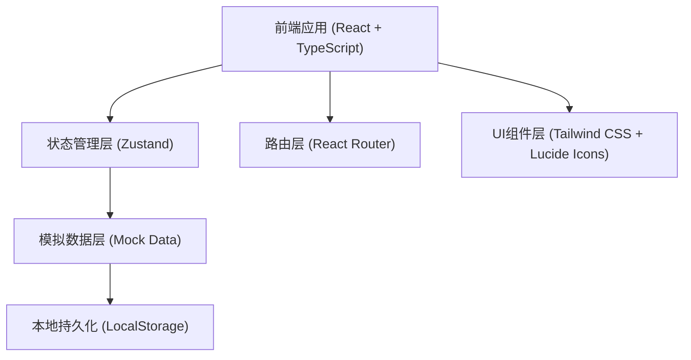
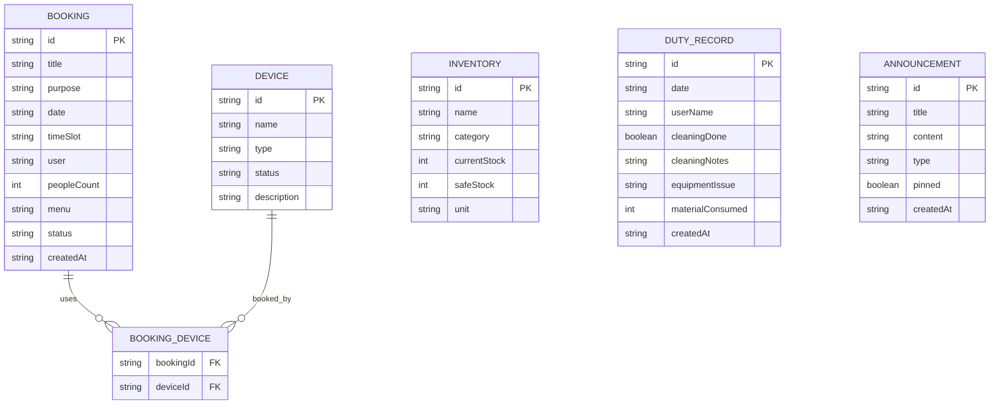

## 1. 架构设计



## 2. 技术描述

- **前端**：React@18 + TypeScript + Vite + TailwindCSS@3 + React Router DOM + Zustand + Lucide React
- **初始化工具**：vite-init 使用 react-ts 模板
- **后端**：无后端，使用本地 Mock 数据 + LocalStorage 持久化
- **数据存储**：浏览器 LocalStorage 存储用户预约、物资、值班记录等数据

## 3. 路由定义

| 路由 | 页面用途 |
|-------|---------|
| /calendar | 厨房日历页 - 展示预约日历和时段状态 |
| /booking | 预约申请页 - 提交新的厨房使用预约 |
| /inventory | 物资清单页 - 查看和管理物资库存 |
| /duty | 值班记录页 - 记录值班、清洁和设备情况 |
| /announcements | 公告页 - 查看公告、统计和提醒 |
| / | 默认重定向到 /calendar |

## 4. 数据模型

### 4.1 数据模型定义



### 4.2 类型定义

```typescript
// 预约状态
type BookingStatus = 'pending' | 'confirmed' | 'completed' | 'cancelled';

// 设备状态
type DeviceStatus = 'available' | 'unavailable' | 'maintenance';

// 物资分类
type InventoryCategory = 'kitchenware' | 'ingredients' | 'consumables';

// 公告类型
type AnnouncementType = 'notice' | 'warning' | 'stats';

interface Booking {
  id: string;
  title: string;
  purpose: string;
  date: string;
  timeSlot: string;
  user: string;
  peopleCount: number;
  menu: string;
  deviceIds: string[];
  status: BookingStatus;
  createdAt: string;
}

interface Device {
  id: string;
  name: string;
  type: 'stove' | 'oven' | 'steamer' | 'other';
  status: DeviceStatus;
  description: string;
}

interface Inventory {
  id: string;
  name: string;
  category: InventoryCategory;
  currentStock: number;
  safeStock: number;
  unit: string;
}

interface DutyRecord {
  id: string;
  date: string;
  userName: string;
  cleaningDone: boolean;
  cleaningItems: { name: string; done: boolean }[];
  equipmentIssue: string;
  consumedMaterials: { inventoryId: string; amount: number }[];
  createdAt: string;
}

interface Announcement {
  id: string;
  title: string;
  content: string;
  type: AnnouncementType;
  pinned: boolean;
  createdAt: string;
}

interface TimeSlot {
  id: string;
  label: string;
  startTime: string;
  endTime: string;
  maxPeople: number;
  enabled: boolean;
}
```

## 5. 项目结构

```
src/
├── components/          # 可复用组件
│   ├── Layout.tsx       # 布局组件（导航+内容区）
│   ├── Calendar.tsx     # 日历组件
│   ├── BookingCard.tsx  # 预约卡片
│   ├── InventoryCard.tsx # 物资卡片
│   ├── StatCard.tsx     # 统计卡片
│   └── NavBar.tsx       # 导航栏组件
├── pages/               # 页面组件
│   ├── CalendarPage.tsx
│   ├── BookingPage.tsx
│   ├── InventoryPage.tsx
│   ├── DutyPage.tsx
│   └── AnnouncementsPage.tsx
├── store/               # Zustand 状态管理
│   └── useStore.ts
├── types/               # TypeScript 类型定义
│   └── index.ts
├── data/                # Mock 数据
│   └── mockData.ts
├── utils/               # 工具函数
│   └── helpers.ts
├── App.tsx
├── main.tsx
└── index.css
```
